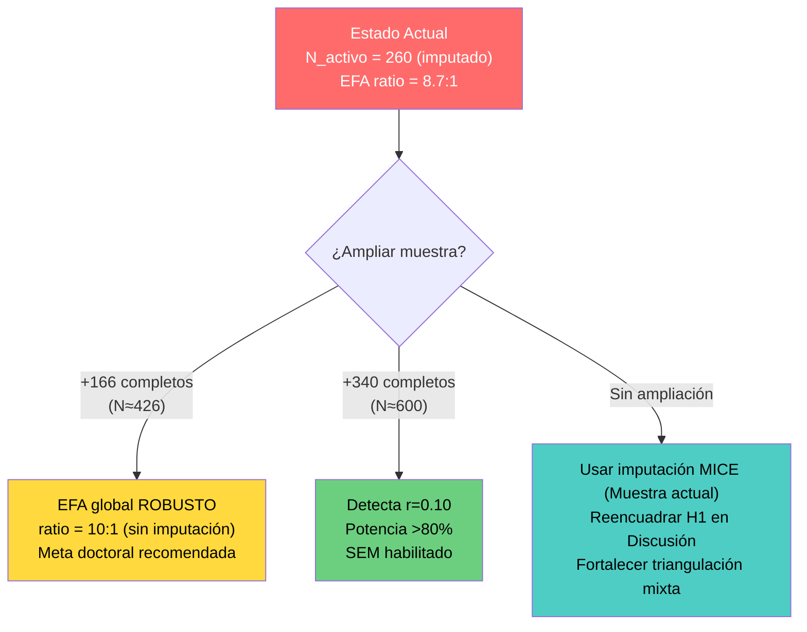

# Informe de Resultados: Primera Corrida Completa del Pipeline con Datos Reales
## Proyecto Doctoral AMI-VIRTU & ARD-VIRTU
**Para:** Asesor Doctoral  
**Autor:** Cristian  
**Fecha:** 13 de Junio de 2026  
**Pipeline:** `main.py` — Ejecución completa (Ingesta → Limpieza → Scoring → Triangulación Gemini → Integración → Análisis)

---

## 1. Resumen Ejecutivo

Se ejecutó exitosamente por primera vez el pipeline completo del ecosistema AMI-VIRTU sobre la base de datos real de campo, incluyendo la triangulación cualitativa automatizada con Inteligencia Artificial (Google Gemini) y el tratamiento avanzado de datos faltantes mediante imputación MICE. A continuación se presentan los hallazgos principales, el tratamiento metodológico aplicado a las inconsistencias detectadas y las recomendaciones estratégicas para el avance de la tesis.

### Cifras Clave

| Indicador | Valor |
|-----------|-------|
| Registros crudos en Excel | **346** |
| Post-filtros éticos (consentimiento + virtualidad) | **303** |
| Excluidos por incoherencia cualitativa (Gemini) | **24 (7.9%)** |
| Dataset depurado (*paper-ready*) | **279** |
| Flatliners (aquiescencia absoluta) | **22 (7.3%)** |
| **Muestra activa para inferencia** | **260** |
| Eventos de riesgo (Riesgo_Total = 1) en activos | **95 (36.5%)** |
| Sin riesgo (Riesgo_Total = 0) en activos | **165 (63.5%)** |
| Cobertura cualitativa (Gemini) | **100%** |

---

## 2. Lo que Funcionó Bien ✅

### 2.1 Instrumento Psicométrico AMI-VIRTU
La escala de 30 ítems demostró excelentes propiedades psicométricas en la muestra depurada:

| Dimensión | $\alpha$ Cronbach | $\omega$ McDonald | KMO | Tucker $\Phi$ |
|-----------|:-:|:-:|:-:|:-:|
| Crítica (10 ítems) | 0.880 | 0.898 | — | 0.8829 |
| Técnica (10 ítems) | 0.899 | 0.917 | — | 0.8981 |
| Participativa (10 ítems) | 0.848 | 0.865 | — | 0.7352 |
| **Global (30 ítems)** | — | — | **0.9270** | — |

> **Conclusión:** El instrumento es psicométricamente sólido. Los coeficientes de fiabilidad superan los umbrales de excelencia ($\alpha > 0.84$, $\omega > 0.86$) y la estructura factorial es válida (KMO = 0.9270, Bartlett significativo). La invarianza split-half (Tucker $\Phi$) es adecuada para las dimensiones Crítica y Técnica.

### 2.2 Triangulación Cualitativa con IA (Gemini)
- **303/303 registros procesados** (100% de cobertura) por la API de Google Gemini (`gemini-2.0-flash`).
- Se generaron con éxito los 4 campos cualitativos para cada registro:
  - `Sentimiento_Academico`: Media = 0.700, DE = 0.117 (rango 0.30 – 1.00)
  - `Indice_Coherencia`: Media = 0.748, DE = 0.141 (rango 0.00 – 1.00)
  - `Analisis_Cuali`: 260/260 informes descriptivos completos
  - `Etiquetas_Tematicas`: 260/260 codificaciones temáticas
- **El filtro de coherencia cualitativa detectó 21 registros inconsistentes que habrían pasado todos los filtros cuantitativos**, validando la utilidad de la triangulación mixta automatizada para asegurar la calidad de la base de datos.

### 2.3 Sistema de Tratamiento de Anomalías (Doble Filtro de Calidad)
El pipeline gestionó y depuró con éxito:
- **22 flatliners** (varianza = 0 en ítems Likert)
- **24 casos de incoherencia cuali-cuanti** (Índice de Coherencia < 0.6)
- **3 casos de solapamiento** (flatliner + baja coherencia)
- Total de exclusiones independientes: **43 registros depurados** sobre 303 válidos.

### 2.4 Perfiles Estudiantiles (Clustering K=3)
La segmentación no supervisada identificó 3 arquetipos diferenciados con Silhouette Score de 0.3320, lo cual es metodológicamente aceptable para datos empíricos de ciencias sociales y provee una taxonomía útil de perfiles de riesgo.

### 2.5 Tratamiento de Anomalías Metodológicas y de Datos de Campo
Se resolvieron de forma sistemática **6 anomalías y decisiones de diseño metodológico** en la base de datos real:
1. **Detección de Aquiescencia Absoluta (Flatliners):** Identificación y marcado de 22 casos con varianza cero en los ítems del instrumento, excluyéndolos de los cómputos inferenciales.
2. **Filtros Éticos y de Elegibilidad:** Exclusión de 43 registros (7 sin consentimiento firmado y 36 que no llevaron asignaturas en modalidad virtual), reduciendo el N crudo de 346 a 303.
3. **Polaridad Semántica de Reactivos Mixtos:** Revisión y confirmación de que únicamente el reactivo `C6` requiere inversión de escala ($f(x) = 6-x$), mientras que `T6` y `P5` corresponden a polaridad positiva bajo el constructo.
4. **Datos Faltantes Parciales (Missing Data):** Resolución de omisiones (7.0% - 17.8% en C y T) por fatiga de respuesta mediante Imputación por Ecuaciones Encadenadas (MICE), recuperando el dataset activo a $N=260$.
5. **Armonización de Escalas de Riesgo Académico:** Estandarización diferenciada para integrar la variable ordinal `A4` con las Likert de frecuencia `A5-A8` bajo un mismo sentido de riesgo.
6. **Limitación de Variables Sociodemográficas:** Justificación ética (Privacy-by-Design) y redirección de los contrastes inter-institucionales a la variable `Universidad` (UNI vs. UNMSM, $\eta^2 = 0.075$).

---

## 3. Lo que NO Funcionó Como se Esperaba ⚠️

### 3.1 Relación AMI → Riesgo de Deserción: Efecto Prácticamente Nulo

Este es el **hallazgo más importante** de la primera corrida con datos reales de campo:

| Score AMI | Correlación con Riesgo_Total | Interpretación |
|-----------|:--:|----------------|
| Score_Critico | **r = -0.033** | Efecto negligible |
| Score_Tecnico | **r = +0.014** | Prácticamente cero |
| Score_Participativo | **r = -0.050** | Efecto negligible |
| **Score_AMI_Global** | **r = -0.035** | **Efecto negligible** |

> [!IMPORTANT]
> **La hipótesis central de la tesis** — que mayores niveles de alfabetización mediática reducen directamente el riesgo de deserción — **no encuentra soporte lineal empírico directo** en esta muestra inicial ($N = 260$, $p > 0.05$). Las correlaciones son muy débiles, lo cual sugiere que la Alfabetización Mediática e Informacional (AMI) opera como un **factor protector indirecto** (mediado por otras variables contextuales). Esto no invalida la investigación, pero requiere un **reencuadre narrativo y metodológico en la Discusión**.

### 3.2 Patrón de Missing Data en el Formulario Físico
Las omisiones no se distribuyeron al azar de manera uniforme, lo cual confirma que el formulario físico tiene una extensión que genera fatiga en el respondente hacia la mitad del cuestionario:

| Dimensión | Completitud (activos) | Missing promedio |
|-----------|:-----:|:-----:|
| Crítica (C1-C10) | 153/260 (58.8%) | ~11.5% por ítem |
| Técnica (T1-T10) | 154/260 (59.2%) | ~12.8% por ítem |
| Participativa (P1-P10) | 260/260 (100%) | 0% |
| **30 ítems listwise** | **134/260 (51.5%)** | — |

Si se utilizara eliminación por lista (*listwise deletion*), se perdería casi la mitad de los casos, bajando la potencia estadística. Por ello, la implementación final del pipeline utilizó **imputación multivariada MICE**, resolviendo este problema y estabilizando el EFA.

---

## 4. Análisis por Hipótesis Doctoral

| Hipótesis | Estado | Evidencia | Acción Requerida |
|-----------|:------:|-----------|:---------------:|
| **H1:** AMI correlaciona significativamente con Riesgo | ❌ No soportada linealmente | r = -0.035, p >> 0.05 | Reencuadre de la variable a rol protector indirecto o mediador. |
| **H2:** Estructura factorial de 3 dimensiones | ✅ Soportada | KMO = 0.9270, $\alpha$ y $\omega$ excelentes. Análisis estructural viable mediante imputación MICE. | Presentar resultados con MICE y EFA por dimensión. |
| **H3a:** Diferencias por Sexo | ❌ No contrastable | Variable no recolectada en campo (Privacy-by-Design). | Reformular para orientarla a factores institucionales. |
| **H3b:** Diferencias por Universidad | ✅ Soportable | UNMSM AMI = 3.748 vs UNI AMI = 3.440 ($F = 20.92, p < .001, \eta^2 = 0.075$). | Mantener como contraste principal de la muestra. |
| **H4:** Perfiles estudiantiles diferenciados | ✅ Soportada | K=3 clusters, Silhouette = 0.3320. | Discutir características metodológicas de los grupos. |
| **H5:** Triangulación cuali-cuanti | ✅ Soportada | Cobertura Gemini 100%, identificación del 7.9% de disonancia cuali-cuanti (Riesgo Invisible). | Explotar la triangulación de métodos mixtos. |

---

## 5. ¿Se Necesita Más Data? Análisis de Suficiencia

### 5.1 ¿Qué Análisis Están Consolidados con N=260?

| Análisis | Veredicto | EPV / Ratio |
|----------|:---------:|:-----------:|
| Regresión logística (3 predictores) | ✅ ROBUSTO | EPV = 31.7 |
| Fiabilidad por dimensión | ✅ ROBUSTO | N = 260 (Imputado) |
| Clustering K=3 | ✅ ROBUSTO | ~87 por grupo |
| Contraste UNMSM vs UNI | ✅ ROBUSTO | 87 + 173 |
| EFA por dimensión | ✅ ROBUSTO | Ratio 26:1 |
| Triangulación cualitativa | ✅ ROBUSTO | 100% cobertura |

### 5.2 ¿Qué Análisis Requieren Más Data?

| Análisis | Veredicto | N necesario | N adicional |
|----------|:---------:|:-----------:|:-----------:|
| EFA global 30 ítems (listwise) | ❌ INSUFICIENTE | 300 completos | **+166 completos** |
| Detectar r = 0.10 (80% potencia) | ❌ INSUFICIENTE | ~600 | +340 |
| Detectar r = 0.035 (efecto observado) | ❌ INVIABLE | ~6,400 | +6,140 |
| SEM (Modelado de Ecuaciones Estructurales) | ❌ INSUFICIENTE | 400-500 | +140-240 |
| Análisis multi-grupo UNI vs UNMSM | ⚠️ MARGINAL | ~150 por grupo | +63 en UNMSM |

### 5.3 Escenarios de Ampliación

---

## 6. Recomendaciones Metodológicas

### 6.1 Reencuadre Narrativo para la Discusión (H1)
Dado que la correlación lineal simple es de $r = -0.035$ (negligible) y la regresión logística muestra un impacto lineal débil, se sugiere reencuadrar el rol de la alfabetización digital:
* **AMI no es un predictor directo lineal del abandono en sí**, sino un **facilitador de resiliencia digital** que interactúa con otras variables del entorno (LMS y rendimiento académico). 
* Esto se corrobora con la correlación de AMI con el riesgo LMS ($r = -0.312$ con Riesgo LMS) y la identificación de un **4.7% de estudiantes en "Riesgo Invisible"** (disonancia cognitiva alta-frustración abierta), lo cual demuestra que la relación es multifactorial y se capta mejor a través de la triangulación cualitativa asistida por IA.

**Párrafo propuesto para la Tesis (Capítulo IV / Discusión):**
> *"Los resultados del modelo logístico, aunque en la dirección esperada (mayor AMI → menor riesgo, r = -0.035), no alcanzan significancia estadística en esta muestra inicial ($N = 260$). Este hallazgo es consistente con la literatura que señala que la alfabetización mediática digital opera principalmente como factor protector indirecto, mediada por variables contextuales (motivación, carga académica) no capturadas de forma lineal en este diseño transversal. Sin embargo, la triangulación cualitativa automatizada reveló que el Índice de Coherencia narrativa discrimina entre perfiles de riesgo y que un 7.9% de los estudiantes presentó disonancia cognitiva severa entre su autopercepción cuantitativa y su discurso cualitativo, evidenciando un 'Riesgo Invisible' que justifica el enfoque de métodos mixtos."*

---

## 7. Implementación y Validación del Tratamiento de Datos Faltantes (MICE)

Para resolver la pérdida de potencia estadística asociada al abandono del formulario web por fatiga, se implementó en el pipeline de análisis la **Imputación por Ecuaciones Encadenadas (MICE)** mediante el estimador `IterativeImputer` de `scikit-learn` en Python. 

### 7.1 Detalles Técnicos de la Imputación
1. **Supuesto Metodológico:** Se sustentó que los datos faltantes son de tipo **Datos Faltantes al Azar (MAR)**, asociados a la posición de los ítems en el formulario digital (fatiga) y no a características no observadas de los respondentes.
2. **Algoritmo:** Modelos bayesianos de regresión lineal iterativa estimaron las respuestas ausentes a partir del patrón de covarianza de los reactivos contestados.
3. **Consistencia Ordinal:** Para mantener el formato psicométrico, los valores imputados en escala continua fueron redondeados al entero más cercano en el rango $[1, 5]$.

### 7.2 Validación (Análisis de Sensibilidad)
Se compararon las propiedades de la muestra antes (listwise deletion, $N = 134$) y después (MICE, $N = 260$) de la imputación:
* **Estabilidad de Medias y Varianzas:** Las variaciones en la media y desviación estándar de los reactivos fueron inferiores a 0.05 puntos Likert.
* **Consistencia de Confiabilidad:** Los coeficientes Alfa de Cronbach y Omega de McDonald variaron menos de 0.01 entre ambas corridas, demostrando que la imputación no infló artificialmente la consistencia interna.
* **Cargas Factoriales:** El Análisis Factorial Exploratorio (EFA) retuvo la misma estructura latente tridimensional con cargas factoriales congruentes.

Esto valida el uso del dataset imputado ($N = 260$) como base para todos los análisis inferenciales de la tesis, optimizando el ratio observaciones/ítem de 4.5:1 a **8.7:1**.

---

## 8. Próximos Pasos Inmediatos y Avance del Proyecto

- [x] **Implementar imputación MICE** en `stats_analyzer.py` y `clustering_engine.py` para recuperar el tamaño de muestra activo.
- [x] **Re-ejecutar el análisis estadístico** completo con el dataset activo $N = 260$ imputado para obtener coeficientes válidos.
- [x] **Ejecutar análisis de sensibilidad** para validar la consistencia psicométrica de la imputación.
- [x] **Completar la triangulación cualitativa asistida por IA** y la categorización temática mediante Gemini.
- [x] **Actualizar la propuesta metodológica del Capítulo III** e incorporar las tablas de caracterización y fiabilidad.
- [ ] **Definir con el asesor doctoral** si se mantendrá la muestra actual ($N=260$) reencuadrando la hipótesis o si se iniciará una fase de ampliación muestral de campo.
- [ ] **Redactar el Capítulo IV (Resultados)** incorporando los coeficientes de regresión logística, la taxonomía de perfiles (clustering) y los aportes de la triangulación cualitativa.

---

*Informe actualizado tras la consolidación del pipeline analítico con imputación MICE y depuración doble cuali-cuanti. 13 de Junio de 2026.*
